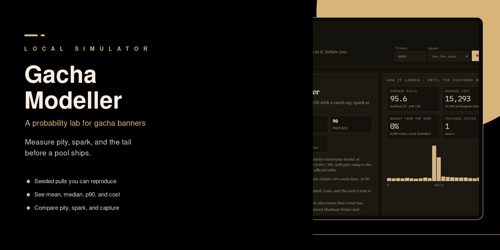

# Gacha Modeller

A local lab for gacha banners, lootbox crates, and the social tricks sitting on a pity bar.



<!-- trophy-proof: screenshot of the lab after a Genshin-like 8k-trial run (histogram + mean/p90 + spark rate). -->

Store pages talk in rates. You live in the tail: the 90th percentile, the spark you had to buy, the second student after the bar reset. Encode a pool here, studied or one you invented, and run it until those numbers are honest.

## What you can do

- **Pull until the featured shows.** You set the trial count. You get mean, median, p90, and a histogram.
- **Cap the tail with a shop.** Spark-if-needed buys the featured when the bar fills. Leave the shop closed if you want the raw distribution.
- **Set 50/50 capturing next to a straight rate-up.** Genshin-like and FGO-like sit in the same catalog so you can see the shape, not argue it.
- **See leftover spark vanish when the pickup lands.** Blue Archive-like Charge resets when the student lands. The old 200 spark does not. Dual pickups are where that hurts.
- **Keep a no-pity crate as the control.** Covert odds around 0.64%, no hug at 90, a long tail. Everything kinder should beat this.
- **Share one pity bar across a guild.** Pool Share wastes leftover pity once, not once per player.
- **Heat the stickers you still lack.** Collection Heat makes unowned pieces more likely. Completing the set is the product.
- **Let chat fill the spark bar.** Audience Spark adds progress per pull. The overlay is the pitch; the number is how much tail you gave away.

## Catalog

Studied presets follow a published or community-consensus shape. They are not licensed live tables.

| Preset | Shape |
| --- | --- |
| Genshin-like Character | 0.6% / 90, soft ramp from 74, 50/50 capturing, spark 180 |
| Blue Archive-like Spark | 0.7% pickup, 200-point spark, leftover bar survives a natural hit |
| Blue Archive-like Charge | JP 5.5: 100 = 50% pickup 3-star, 200 = pickup, hit resets |
| FGO-like Story Banner | 1% SSR, 80% on the rate-up, featured pity at 330 |
| Independent Crate | 0.64% covert, no pity |
| 1% + Hard Pity 100 | Teaching control |

Pool Share, Collection Heat, and Audience Spark are ours. How the engine rolls lives in [docs/methodology.md](docs/methodology.md). Blue Archive charge vs spark is in [docs/blue-archive-recruitment.md](docs/blue-archive-recruitment.md).

## Run it

```bash
cd /mnt/c/git-public/Gacha-Modeller
npm install
npm test
npm run dev
```

Open http://127.0.0.1:3018/. Pick a banner, set trials, run. Same seed (`20260823`) gives you the same histogram.

## Limits

- No live game APIs. If a real banner changed last Tuesday, this lab does not know.
- No session calendars, first-time packs, or store UI. Those wait on a player-time model.
- No legal opinion on lootboxes.

## License

MIT. Copyright 2026 Apostol Apostolov.
